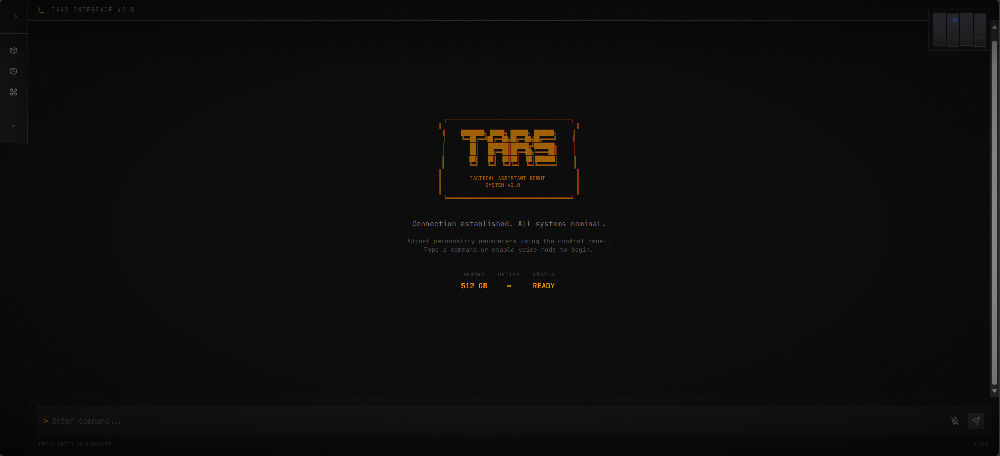

<div align="center">
  
</div>

# TARS Chatbot

[](https://www.python.org/downloads/)
[](https://opensource.org/licenses/MIT)
[](https://fastapi.tiangolo.com)
[](https://react.dev)

## Overview

TARS (Tactical Advanced Robot System) is an advanced AI chatbot inspired by the character from the film *Interstellar*. This project leverages modern Large Language Models (LLMs) and a Retrieval-Augmented Generation (RAG) architecture to provide a robust, context-aware conversational experience. It features a dual-interface design offering both a comprehensive Command Line Interface (CLI) and a modern React-based Web UI.

## Visual Interface

<div align="center">
  <table>
    <tr>
      <td align="center">
        
        <br />
        <b>Main Chat Interface</b>
      </td>
      <td align="center">
        
        <br />
        <b>System Diagnostics</b>
      </td>
    </tr>
    <tr>
      <td align="center">
        
        <br />
        <b>Data Analysis View</b>
      </td>
      <td align="center">
        
        <br />
        <b>Interactive Mode</b>
      </td>
    </tr>
  </table>
</div>

## Key Features

*   **Multi-LLM Support**: Seamless integration with local models via LM Studio and Ollama, as well as cloud providers like OpenAI and Google Gemini. Includes automatic fallback mechanisms for high availability.
*   **Retrieval-Augmented Generation (RAG)**: specialized knowledge base powered by ChromaDB, enabling accurate responses on specific domains such as Physics, Astronomy, and Movie Lore.
*   **Personality Engine**: Configurable parameters for Humor, Honesty, and Discretion to simulate the distinct TARS personality.
*   **Voice Interaction**: Integrated speech-to-text and text-to-speech capabilities for hands-free operation.
*   **Modern Architecture**: Built on a FastAPI backend with WebSocket support for real-time streaming, coupled with a responsive React + Vite frontend.

## Architecture

The system utilizes a modular architecture:
*   **Backend**: Python 3.11+, FastAPI, WebSocket.
*   **Frontend**: React, Vite, TailwindCSS.
*   **Database**: ChromaDB for vector storage.
*   **AI/ML**: Integration with various LLM providers (Local & Cloud).

## Installation

### Prerequisites
*   Python 3.11 or higher
*   Node.js & npm (for Frontend)
*   [LM Studio](https://lmstudio.ai/) (Optional, for local LLM inference)

### Setup

1.  **Clone the repository:**
    ```bash
    git clone https://github.com/Anbu-Malligarjun-Sri/tars-chatbot-python.git
    cd "TARS chatbot version 1"
    ```

2.  **Install Backend Dependencies:**
    ```bash
    pip install -r requirements.txt
    ```

3.  **Install Frontend Dependencies:**
    ```bash
    cd frontend
    npm install
    cd ..
    ```

## Configuration

1.  Copy the example environment file:
    ```bash
    cp .env.example .env
    ```

2.  Configure the `.env` file with your specific settings. Common variables include:

    ```ini
    # LLM Settings
    LLM_PROVIDER=lm_studio
    LM_STUDIO_BASE_URL=http://localhost:1234/v1
    
    # API Keys (if using cloud providers)
    OPENAI_API_KEY=your_key_here
    GEMINI_API_KEY=your_key_here
    ```

## Usage

### Running the Application (Full Stack)

To run both the backend API and the frontend interface:

**Backend (Terminal 1):**
```bash
python -m src.interfaces.api
```

**Frontend (Terminal 2):**
```bash
cd frontend && npm run dev
```

Access the Web UI at `http://localhost:8081`.

### CLI Mode

For a text-based experience directly in your terminal:

```bash
python main.py chat
```

To enable voice interaction:
```bash
python main.py chat --voice
```

## API Documentation

The backend provides several key endpoints:
*   `POST /api/chat`: Send a message and receive a response (supports streaming).
*   `GET /api/history`: Retrieve conversation history.
*   `GET /api/rag/stats`: Get statistics on the RAG knowledge base.

## License

This project is licensed under the MIT License. See the [LICENSE](LICENSE) file for details.
